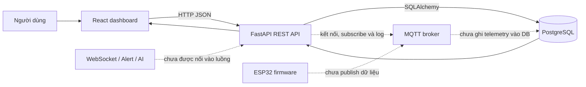

# Luồng hoạt động hiện tại của Disaster Warning Station

Tài liệu này mô tả trạng thái **code đang có trong working tree hiện tại**. Hệ thống mới hoàn thiện luồng web/database và một phần kết nối MQTT; các phần firmware, AI, cảnh báo và WebSocket vẫn là khung để phát triển sau.

## 1. Phạm vi đang thực sự hoạt động

Luồng chính hiện tại:



- Dashboard đọc trạng thái hệ thống, đọc tối đa 20 bản ghi gần nhất và cho phép nhập một bản ghi cảm biến bằng tay.
- FastAPI kiểm tra request bằng Pydantic, gọi repository SQLAlchemy và lưu vào bảng `devices` cùng `sensor_readings`.
- Backend khởi động một MQTT client, subscribe hai topic và báo trạng thái MQTT qua API health. Message nhận được hiện chỉ được ghi log, chưa parse hoặc lưu database.
- Không có dữ liệu mock trong frontend và chưa có cập nhật realtime. Nút **Làm mới** gọi lại REST API.
- Firmware chỉ mở Serial; AI, alert service và WebSocket manager chưa có logic thực thi.

## 2. Làm sao để chạy

### 2.1. Yêu cầu

- Python 3.10 trở lên.
- Node.js `^20.19.0` hoặc `>=22.12.0` theo các package frontend hiện tại.
- PostgreSQL; có thể cài trực tiếp, dùng cloud hoặc chạy bằng Docker Compose.
- MQTT broker là tùy chọn để thử phần MQTT. Nếu broker không chạy, REST API và database vẫn có thể hoạt động, còn `/api/health` sẽ báo `mqtt: disconnected`.

### 2.2. Cấu hình `.env`

Backend và frontend cùng đọc file `.env` ở thư mục gốc repository. Tối thiểu cần cấu hình:

```dotenv
APP_ENV=development
DATABASE_URL=postgresql://<user>:<password>@localhost:5432/<database>
CORS_ORIGINS=http://localhost:5173
VITE_API_BASE_URL=http://localhost:8000

MQTT_BROKER_HOST=127.0.0.1
MQTT_BROKER_PORT=1883
MQTT_USERNAME=
MQTT_PASSWORD=
MQTT_CLIENT_ID=disaster-warning-backend
```

Lưu ý:

- `DATABASE_URL` là bắt buộc. Thiếu biến này thì backend lỗi ngay khi import `settings`.
- `VITE_API_BASE_URL` là bắt buộc. Thiếu biến này thì frontend báo lỗi khi nạp module cấu hình.
- `CORS_ORIGINS` có thể chứa nhiều origin, phân cách bằng dấu phẩy.
- `.env` hiện còn có `FASTAPI_HOST` và `FASTAPI_PORT`, nhưng code chưa đọc hai biến này. Khi chạy `python -m app.main`, backend đang cố định ở `127.0.0.1:8000`.
- Không commit `.env` vì có thể chứa mật khẩu. File đã nằm trong `.gitignore`.

### 2.3. Khởi động PostgreSQL và MQTT bằng Docker

Từ thư mục gốc repository:

```powershell
docker compose up -d database mqtt-broker
```

`docker-compose.yml` tạo:

- PostgreSQL trên cổng `5432`, dùng volume `db_data`.
- Eclipse Mosquitto trên cổng MQTT `1883`, cho phép kết nối anonymous theo cấu hình hiện tại.

Nếu dùng giá trị mặc định của Compose thì `DATABASE_URL` phải dùng đúng database/user/password mặc định trong `docker-compose.yml`, hoặc khai báo thêm `POSTGRES_DB`, `POSTGRES_USER`, `POSTGRES_PASSWORD` trong `.env` và dùng cùng các giá trị đó trong URL.

`schema.sql` chỉ được Docker tự chạy khi PostgreSQL khởi tạo một volume dữ liệu mới. Dù không chạy file SQL thủ công, backend vẫn gọi `Base.metadata.create_all()` lúc khởi động để tạo các bảng còn thiếu.

### 2.4. Chạy backend

Mở terminal tại thư mục gốc:

```powershell
cd backend
python -m venv .venv
.\.venv\Scripts\Activate.ps1
python -m pip install -r requirements.txt
python -m app.main
```

Có thể chạy cách tương đương từ `backend/app`:

```powershell
python main.py
```

Các địa chỉ kiểm tra:

- Health: `http://localhost:8000/api/health`
- Swagger UI: `http://localhost:8000/docs`
- Danh sách readings: `http://localhost:8000/api/readings?limit=20`

Khi startup, backend thực hiện theo thứ tự:

1. Trong quá trình import module: đọc `.env`, tạo `settings`, SQLAlchemy engine, MQTT client và hai REST router.
2. Tạo FastAPI app, gắn CORS middleware và đăng ký hai router.
3. Khi server bắt đầu lifespan, gọi `create_tables()`. Nếu database chưa sẵn sàng, lỗi SQLAlchemy được log nhưng server vẫn tiếp tục chạy.
4. Gọi `mqtt_client.connect()` theo kiểu bất đồng bộ và bắt đầu network loop nền.
5. Khi tắt server, publish trạng thái backend offline nếu đang kết nối rồi dừng MQTT loop.

### 2.5. Chạy frontend

Mở terminal khác:

```powershell
cd frontend
npm ci
npm run dev
```

Mở `http://localhost:5173`. `vite.config.js` đặt `envDir: '..'`, vì vậy Vite đọc `.env` từ thư mục gốc thay vì `frontend/`.

Các lệnh frontend khác:

```powershell
npm run build
npm run preview
```

### 2.6. Chạy integration test

Từ thư mục gốc, sau khi đã cài `backend/requirements.txt`:

```powershell
python -m pytest tests/integration/test_readings_api.py -q
```

Test tự đặt `DATABASE_URL` thành một file SQLite tạm trước khi import app, nên không cần PostgreSQL. Test đi qua trọn luồng health → latest rỗng → tạo reading → đọc lại danh sách. MQTT broker cũng không bắt buộc; health chấp nhận cả `connected` và `disconnected`.

## 3. Các file liên kết với nhau như thế nào

### 3.1. Chuỗi khởi động backend

```text
backend/app/main.py
├── app/config/__init__.py
│   └── app/config/settings.py ──> .env
├── app/database/__init__.py
│   └── app/database/connection.py ──> settings.database_url
│       └── app/database/models.py (được import muộn khi create_tables)
├── app/mqtt/__init__.py
│   └── app/mqtt/client.py
│       ├── app/config/settings.py
│       └── app/mqtt/topics.py
└── app/api/__init__.py
    ├── app/api/health.py
    └── app/api/readings.py
```

Vai trò chi tiết:

| File | Liên kết và trách nhiệm |
|---|---|
| `backend/app/__init__.py` | Đánh dấu `app` là package; không khởi tạo service. |
| `backend/app/main.py` | Entry point. Tạo FastAPI app, lifespan, CORS và include health/readings router. Hỗ trợ cả chạy package lẫn chạy trực tiếp. |
| `backend/app/config/settings.py` | Xác định đường dẫn root, gọi `load_dotenv()`, validate cấu hình bằng `Settings`, tách `CORS_ORIGINS` thành danh sách. |
| `backend/app/config/__init__.py` | Re-export singleton `settings` để module khác import ngắn gọn. |
| `backend/app/database/connection.py` | Dùng `settings.database_url` để tạo engine/session; cung cấp `get_db`, health query `SELECT 1` và `create_tables`. SQLite được thêm `check_same_thread=False` để phục vụ test. |
| `backend/app/database/models.py` | Khai báo ORM `Device` và `SensorReading`; kế thừa `Base` từ `connection.py`. |
| `backend/app/database/repository.py` | Chứa truy vấn đọc/ghi. Nhận `Session` từ API và `SensorReadingCreate` từ schemas; trả ORM object để Pydantic serialize. |
| `backend/app/database/__init__.py` | Re-export các thành phần database mà `main.py` và router cần. |
| `backend/app/schemas/readings.py` | Request/response contract của API. Request chỉ nhận subset trường đang dùng; response bật `from_attributes` để đọc ORM object. |
| `backend/app/schemas/health.py` | Contract gồm `backend`, `database`, `mqtt`. |
| `backend/app/schemas/__init__.py` | Re-export ba schema cho các router. |
| `backend/app/api/readings.py` | Khai báo ba endpoint readings; lấy session bằng `Depends(get_db)`, gọi repository và đổi lỗi SQLAlchemy thành HTTP 503. |
| `backend/app/api/health.py` | Kết hợp trạng thái backend cố định, query database và cờ kết nối của MQTT client. |
| `backend/app/api/__init__.py` | Đổi tên/re-export hai router để `main.py` include. |
| `backend/app/mqtt/topics.py` | Nguồn tên topic dùng chung cho MQTT client. |
| `backend/app/mqtt/client.py` | Bọc Paho MQTT; quản lý connect/disconnect, Last Will, subscribe, publish và callback log message. Tạo singleton `mqtt_client` ở cuối file. |
| `backend/app/mqtt/__init__.py` | Re-export class và singleton để `main.py`/health router dùng cùng một client. |

### 3.2. Luồng một request đọc dashboard

1. `frontend/src/main.jsx` mount `<App />` vào `<div id="root">` của `frontend/index.html` và nạp `styles.css`.
2. `App.jsx` chạy `loadDashboard()` trong `useEffect`.
3. `services/api.js` lấy base URL từ `config/env.js`, sau đó gọi `GET /api/health`.
4. `api/health.py` gọi `database_is_available()` và đọc `mqtt_client.is_connected`.
5. Nếu database báo connected, `App.jsx` gọi tiếp `GET /api/readings?limit=20`.
6. `api/readings.py` lấy SQLAlchemy session từ `get_db()`, gọi `repository.list_readings()` và trả danh sách mới nhất trước.
7. `App.jsx` lấy phần tử đầu làm `latest`, truyền dữ liệu xuống `Header`, `MetricCard` và `ReadingsTable`.

`GET /api/readings/latest` tồn tại và được integration test sử dụng, nhưng dashboard hiện không gọi endpoint này.

### 3.3. Luồng tạo một reading

```text
ReadingForm.jsx
  -> App.saveReading()
  -> services/api.createReading()
  -> POST /api/readings
  -> SensorReadingCreate validation
  -> repository.create_reading()
  -> devices + sensor_readings
  -> SensorReadingResponse
  -> App.loadDashboard()
```

Chi tiết quan trọng:

1. `ReadingForm.jsx` giữ state của form, đổi chuỗi input thành number và đổi tên camelCase sang key JSON dạng snake_case.
2. Pydantic kiểm tra nhiệt độ, độ ẩm, gas, mực nước, độ dài ID và độ dài status. API không giới hạn status bằng enum; ba giá trị `NORMAL`, `WARNING`, `DANGER` chỉ là lựa chọn của form hiện tại.
3. Repository tìm `Device` theo `device_id`. Nếu chưa có, nó tạo device tên `Main Station`; nếu đã có, nó cập nhật `online` và `last_seen`.
4. Repository tạo `SensorReading`, đổi `status` thành chữ hoa và dùng `recorded_at` từ request hoặc thời gian UTC hiện tại.
5. Sau `commit()` và `refresh()`, API trả HTTP 201. Frontend hiển thị thông báo rồi tải lại health và 20 readings.

Model database có thêm `gas_filtered`, `distance_cm`, `water_level_percent`, `angle_x`, `angle_y`, `vibration`, `battery_percentage`, nhưng request/response và frontend hiện chưa sử dụng các cột này.

### 3.4. Chuỗi module frontend

| File | Liên kết và trách nhiệm |
|---|---|
| `frontend/index.html` | HTML shell, chứa `#root` và nạp `/src/main.jsx`. |
| `frontend/src/main.jsx` | React entry point; nạp `App.jsx` và CSS toàn cục. |
| `frontend/src/App.jsx` | Điều phối state, request, loading/error/success và ghép toàn bộ component. |
| `frontend/src/config/env.js` | Đọc bắt buộc `VITE_API_BASE_URL` từ `import.meta.env`. |
| `frontend/src/services/api.js` | Lớp HTTP duy nhất: health, list readings và create reading; chuyển lỗi HTTP thành `Error`. |
| `frontend/src/components/Header.jsx` | Hiện badge backend/database và nút refresh. Trạng thái MQTT có trong health response nhưng chưa được hiển thị. |
| `frontend/src/components/MetricCard.jsx` | Component trình bày một chỉ số của reading mới nhất. |
| `frontend/src/components/ReadingForm.jsx` | Thu thập dữ liệu nhập tay và tạo payload POST. |
| `frontend/src/components/ReadingsTable.jsx` | Hiện lịch sử; format thời gian về múi giờ `Asia/Bangkok`. |
| `frontend/src/styles.css` | Toàn bộ layout, status color và responsive breakpoint. |
| `frontend/vite.config.js` | Bật React plugin và chuyển thư mục đọc env lên root. |
| `frontend/package.json` | Khai báo scripts/dependencies; `package-lock.json` khóa phiên bản cài thực tế. |
| `frontend/jsconfig.json` | Cấu hình editor/module resolution cho JavaScript và JSX; không tham gia runtime. |

### 3.5. Database: ORM và SQL thủ công

Hai file mô tả cùng một schema nhưng không import lẫn nhau:

- `backend/app/database/models.py` là nguồn schema mà backend dùng trong runtime và `create_all()`.
- `infrastructure/database/schema.sql` là nguồn khởi tạo cho PostgreSQL Docker hoặc chạy SQL thủ công.
- `docker-compose.yml` mount `schema.sql` vào `/docker-entrypoint-initdb.d/`.

`create_all()` chỉ tạo phần còn thiếu, không phải công cụ migration. Nếu thay đổi cột/index sau khi database đã tồn tại, cần migration hoặc cập nhật schema có kiểm soát; chỉ sửa ORM sẽ không tự biến đổi bảng cũ.

### 3.6. MQTT hiện tại

Khi kết nối thành công, backend:

- Subscribe QoS 1 vào `dws/main/telemetry` và `dws/main/status`.
- Publish retained `{"status":"online"}` vào `dws/backend/status`.
- Khai báo Last Will retained `{"status":"offline"}` trên cùng status topic.
- Decode message UTF-8 rồi log topic/payload.

`dws/main/command/buzzer` đã được khai báo nhưng chưa có code sử dụng. MQTT callback chưa gọi repository, alert service, WebSocket hoặc AI. Cổng `9001` được map trong Compose, nhưng `mosquitto.conf` hiện chỉ khai báo listener MQTT `1883`, chưa cấu hình WebSocket listener cho `9001`.

### 3.7. Các phần chưa tham gia runtime

| Khu vực | Trạng thái hiện tại |
|---|---|
| `backend/app/services/alerts.py` | `AlertService.trigger()` chỉ có `pass`; package này không được app import. |
| `backend/app/websocket/manager.py` | `WebSocketManager.broadcast()` chỉ có `pass`; chưa có WebSocket route. |
| `ai/preprocess.py`, `train.py`, `evaluate.py`, `save_model.py` | Mỗi file chỉ có `main()` rỗng; không được backend import. `ai/requirements.txt` là môi trường độc lập. |
| `firmware/main-station/src/main.cpp` | Chỉ `Serial.begin(115200)`; chưa đọc sensor, Wi-Fi hay MQTT. |
| `firmware/shelf-node/src/main.cpp` | Chỉ `Serial.begin(115200)`; chưa đọc MPU6050, pin hay MQTT. |
| Hai `platformio.ini` | Chọn board/framework và baud monitor cho hai firmware độc lập. |
| `infrastructure/scripts/start-system.ps1` | Chỉ in placeholder, chưa khởi động service. Không dùng file này để chạy hệ thống. |
| `.github/workflows/code-check.yml` | CI placeholder chỉ chạy `echo`; chưa lint, test hoặc build thật. |
| Các file `docs/*.md` và README | Tài liệu tham khảo, không được runtime import; một số mô tả placeholder/cũ có thể chưa phản ánh phần MQTT vừa có trong code. |

## 4. API và dữ liệu hiện có

| Method | Path | Luồng xử lý |
|---|---|---|
| `GET` | `/api/health` | Kiểm tra backend, `SELECT 1` tới database và cờ MQTT. |
| `GET` | `/api/readings?limit=20` | Trả 1–100 readings, sắp xếp `recorded_at` giảm dần. |
| `GET` | `/api/readings/latest` | Trả reading mới nhất hoặc `null`. |
| `POST` | `/api/readings` | Validate payload, tạo/cập nhật device, tạo reading và trả HTTP 201. |

Các response reading hiện chỉ trả: `id`, `device_id`, `temperature`, `humidity`, `gas_raw`, `water_level_cm`, `status`, `recorded_at`.

## 5. Lưu ý khi đọc hoặc phát triển tiếp

- Health trả `backend: online` miễn endpoint đang xử lý được request; đây không phải phép kiểm tra riêng cho tiến trình.
- Dashboard chỉ hiển thị badge backend/database, chưa hiển thị trường `mqtt` dù API đã trả trường này.
- CORS chỉ cho các origin trong `CORS_ORIGINS`; sai origin sẽ khiến trình duyệt chặn frontend dù API vẫn mở trực tiếp được.
- Backend có thể startup khi PostgreSQL chưa sẵn sàng, nhưng các endpoint readings sẽ trả 503 cho tới khi database kết nối được.
- `schema.sql` và ORM phải được giữ đồng bộ bằng tay.
- Mosquitto đang `allow_anonymous true`; cấu hình này phù hợp phát triển local, không phù hợp production.
- Thư mục `__pycache__`, `.pytest_cache`, `node_modules`, build output và environment ảo là artifact sinh ra, không phải source và không tham gia sơ đồ phụ thuộc ở trên.
